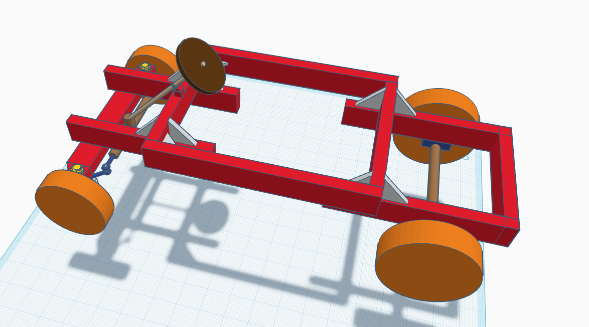

title: Resurrect my disfunctional go kart

author: Harry Liu

description: Redesign and rebuild a go kart from the frame I built two years ago

created_at: 2025-07-03

-----------------------------------------------------

<h2>2025-07-03:</h2>

I went into the garage to take some measurements of the axels and go kart. It currently looks like this:

*INSERT PICTURE HERE WHEN AVAILABLE*

As you can see, the rear part is positioned in a way parallel to the body that puts all the weight on the fasteners connecting the body and the rear (sorry I don't know much about physics so I can't use much techincal terms.) This makes the rear very prone to collapse if I frequently encounter bumps (in my neighbourhood there are a lot of bumps on the sidewalks)

The front is also bad because:
1. The body frame is blocking where the wheel should be going
2. The front wheel axel wants to stretch out fully but can't, making the rack-and-pinion system move quite roughly
3. The center part of the front axel lacks a place to stay suspended and is temporarily held down by those funny round sickle-like clipper things, which grind against the rubber cover as the wheel gets steered around.

The go kart also does not have a motor nor battery that can sufficiently power it.

I've also selected a 48V 2000W motor and battery on Amazon, it goes above the 150USD fund for a 6 point project but I can pay out of pocket (my house is ontop of a mountain so getting up is quite difficult)

After that, I saw some diagrams and pictures online of go kart frames and drew this quick design sketch:

With the new design I'm trying to focus on two things
1. Eliminate structural weakpoints by stacking things ontop of eachother
2. Make sure that there are enough space for the front axel rack and pinion thing to rotate comfortably.

Next I'm going to model it on Fusion360

<h3>TIME: 2 hours 18 mins</h3>

<h2>2025-07-03's night:</h2>

Okay so I drafted this design in TinkerCAD (I didn't use fusion because I didn't need very percise design as I would be handbuilding it anyway.) I had to change some stuff up along the way, but here's how it looks!

The design now:

1. Allows the front axle to straighten out fully (more like how it would usually comfortably operate, less resistance overall)
2. Has mounting for steering axle instead of on the rack and pinion's rubber cover (does not push the rubber cover around, more grip overall)
3. Things are in general stacked on top of eachother, less prone of structural stress.

<h3>TIME: 3 hours 23 mins</h3>