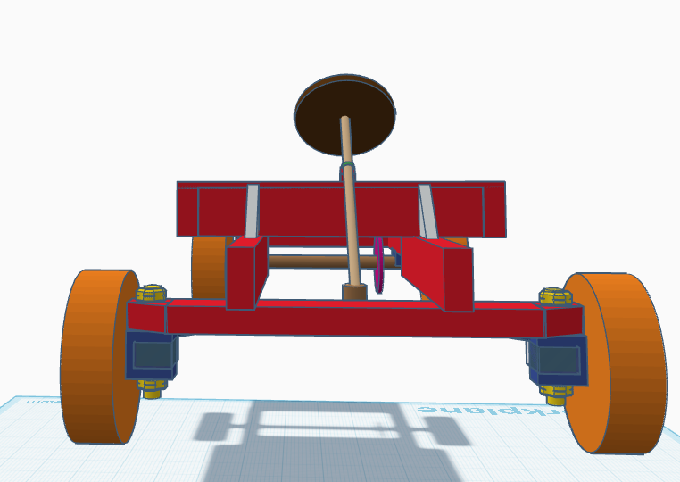
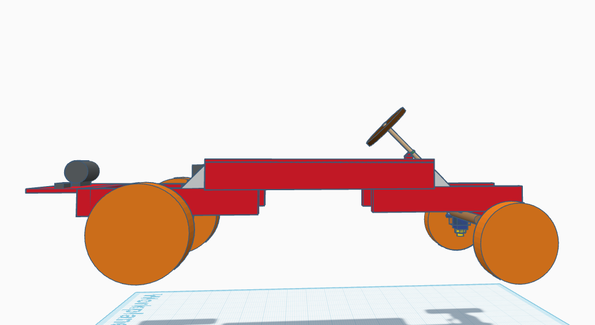
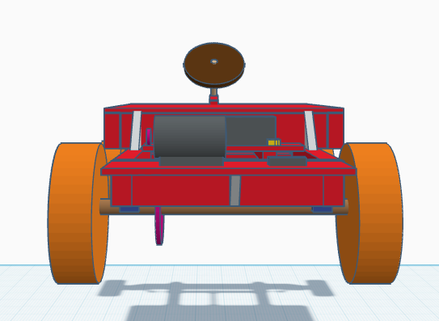
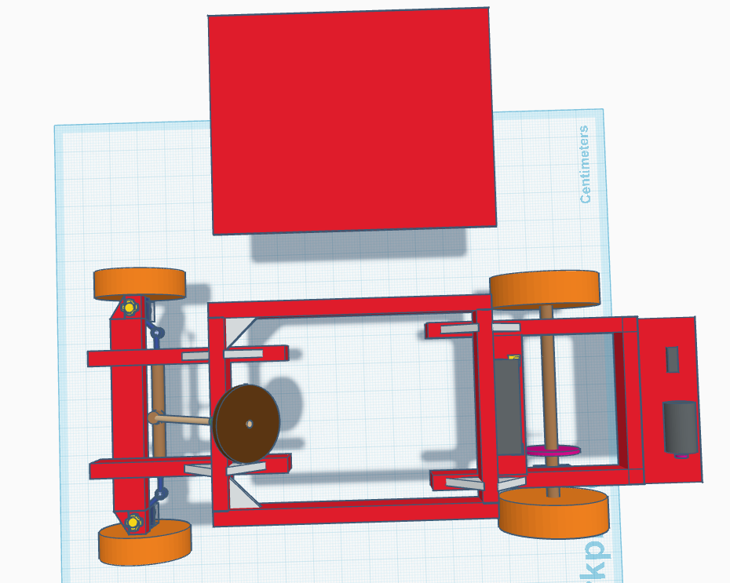
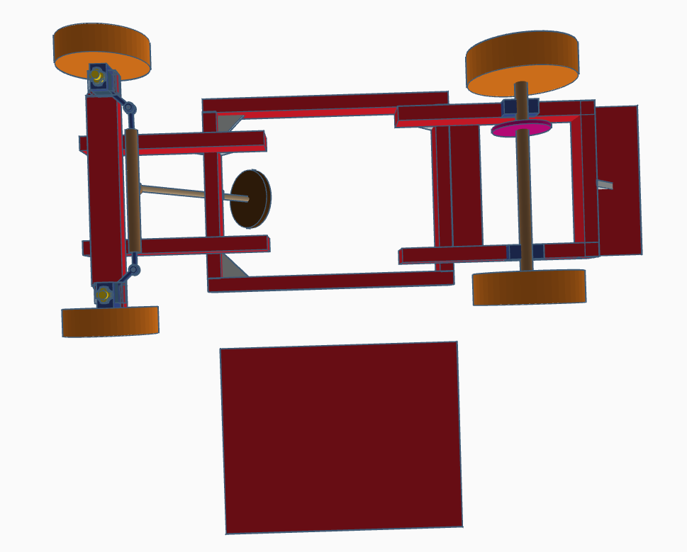
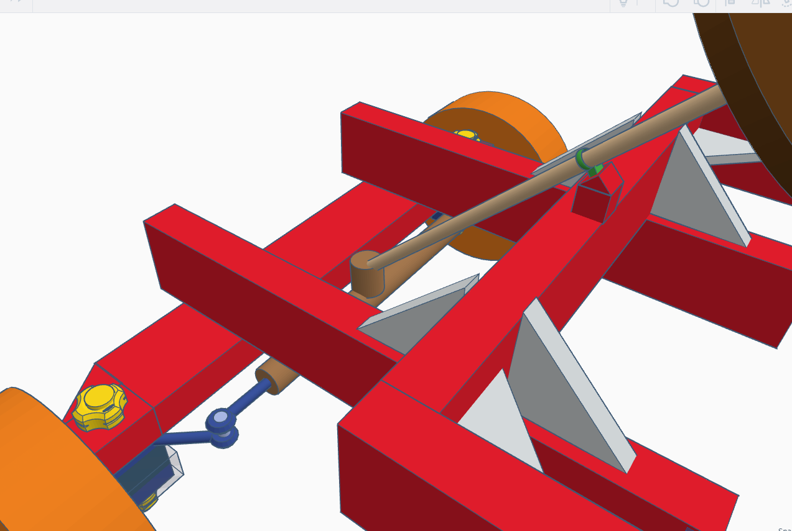
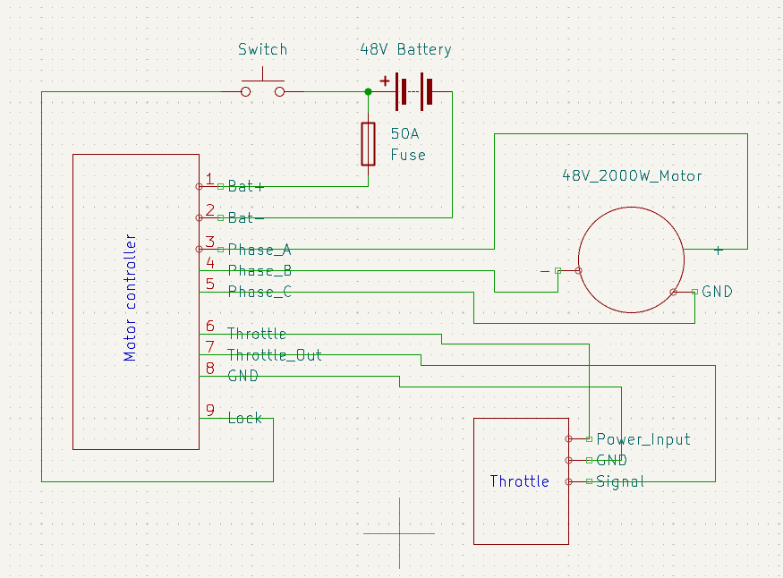

# Resurrected-gokart
High seas project to resurrected my partially successful go kart build

<h3>Project Description</h3>

In 2022 I made a go kart that never ran, partially because it was poorly constructed but also because I lacked the necessary parts. Since then, I've always wanted to re-build this go kart so that it's functional. This project is a revamp of that initiative. The project is, well, a go kart. It is designed to traverse difficult terrain like dirt and uphill routes at a moderate speed (given the environment in my community). It's esentially what you'd expect from an electric go kart, except it's more meant towards carrying me up the mountain rather than speed and agility.

It should be mentioned that the kart would be built from scratch under a very different design, with materials being transferred from the previous kart.

<h3>Why I built it</h3>

Back in 2020 one of my friends got a Ninebot go kart and I was really jealous. After a good round of soccer and some dopamine to druken up my brain I vowed to two of my buddies that I would build a go kart just like it.

Unfortunately, due to me being rather careless during the construction, the current design (see journal) is not very stable and could not run at all due to my meager 24V 350W motor. Even if it could run, its poor structure would probably cause the rear segment to collapse after some bumps.

As mentioned, I want to use this opportunity to rebuild it and a stronger, more expensive motor so that it could actually run. I don't want this project to just be abandonded.

<h3>Pictures of my project</h3>

The 3D model is sketched with the size of things in mind. However, the exact dimensions of the kart most likely will be determined and adjusted during construction

**Legend:**

Red = wood

Orange = tires

Light grey = reinforce metal plates

Yellow = bolts to secure front wheel / mounting to secure battery

Dark grey = motor (cylinder) / battery (big rectangle) / motor controller (small rectangle)

Pink-purple = gears

Green = mounting to secure and hold front axle

Blue = Wheel mountings

Brown = steering wheel

**3D model-front**

**3D model-side**

**3D model-back**

**3D model-top**

The wooden board meant to suspend the seat is removed from the kart to show the inside

**3D model-bottom**

**Steering system**

The new system allows the front axle to straighten out fully (less resistance overall). It also holds the center via the steering axle. The previous design grips via the rubber cover of the rack and pinion system, which pushes it around and may cause it to break if steered excessively.

**Wiring diagram**

I've only included the necessary pins on the motor controller because they'd usually come with a lot more. Sorry that it's a bit bare, I couldn't find symbols so I had to make custom ones.

<h3>BOM</h3>

Note: The material needed exceeds the maximum budget of a 6-point project. If the project fits in this tier, I will happily pay the exceeding amount. However, if this can qualify as a 10 point project, that'd be super great as well.

| Platform   | Description                             | Price per listed lot | # of parts per listed lot | Lots purchased | Final price (CAD) | Final price (USD) | Already owned? | Comments                                                      | Link |
|------------|------------------------------------------|----------------------:|---------------------------:|----------------:|-------------------:|-------------------:|----------------|---------------------------------------------------------------|------|
| Any        | Wood                                     |                     – |                        –   | –              | –                 | –                 | Yes            | My dad has a bunch of wood left                               | –    |
| Any        | Metal fasteners                          |                     – |                        –   | –              | –                 | –                 | Yes            | Again, my dad works in HVAC so he has a bunch of them         | –    |
| Any        | Triangle metal gusset plates             |                     – |                        –   | –              | –                 | –                 | Yes            | There's a couple of them left in the garage                   | –    |
| Amazon     | Rear wheel axle set                      |                 199.89 |                         1 | 1              |            199.89 |            147.92  | Yes            | Purchased in 2022                                             | [Link](https://www.amazon.ca/Tacsal-Rear-Axle-Shaft-Assembly/dp/B0DNQT6FHH/) |
| Amazon     | Front wheel axle set                     |                  80.99 |                         1 | 1              |             80.99 |             59.93  | Yes            | Original 2022 listing is gone, this is the closest I can find | [Link](https://www.amazon.ca/dp/B07ZQ54MXW) |
| Amazon     | 48V 2000W motor kit (+motor controller)  |                 166.54 |                         1 | 1              |            166.54 |            123.24  | No             | –                                                             | [Link](https://www.amazon.ca/VEVOR-2000W-Electric-Brushless-Motor/dp/B0DT3RT5NY) |
| Amazon     | 48V 48AH battery                          |                 133.99 |                         1 | 1              |            133.99 |             99.15  | No             | –                                                             | [Link](https://www.amazon.ca/Lithium-Battery-Protectio-200-2000W-Electric/dp/B0F449L6LZ) |
| –          | –                                        |                     – |                        –   | –              | –                 | –                 | –              | –                                                             | –    |
| –          | –                                        |                     – |                        –   | Total (CAD, USD): |            300.53 |            222.39  | –              | –                                                             | –    |